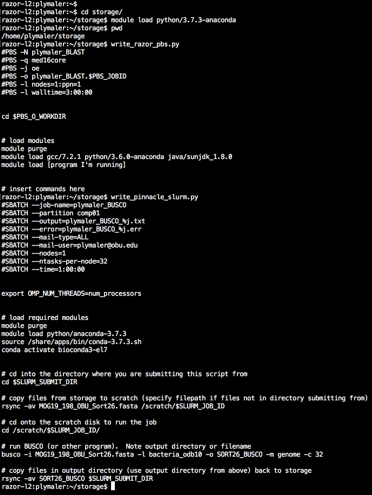

## BIOL5153
This respository is for BIOL 5153, Practical Programming for Biologists, and is where I will submit assignments for the course.

### Assn 03 - Using pbs scripts to run BASH on AHPCC Razor  
The files for assignment 03 are in assn03.tgz.  A brief description of each file is below.  
**1.** plymale_assn03.1* are the pbs script and merged standard out plus standard error for the BLASTN comparison of the watermelon nad4L gene with a database made from the same gene.  
**2.** plymale_assn03.2* are the pbs script and merged standard out plus standard error for the BLASTN comparison of the watermelon nad4L gene with a database made from all of the watermelon mitochondrial genes.  
**3.** plymale_assn03.3* are the pbs script and merged standard out plus standard error for the BLASTN comparison of the watermelon nad4L gene with a database made from the complete watermelon genome.  
**4.** plymale_assn03.4* are the pbs script and merged standard out plus standard error for the BLASTN comparison of the watermelon nad4L gene with a database made from the sequenced plant mitochondrial genomes.  
**5.** plymale_assn03.6* are the pbs script and merged standard out plus standard error for the TBLASTN comparison of the watermelon nad4L gene with a database made from all of the watermelon mitochondrial genes.  
**6.** plymale_assn03.xlsx inclues raw scores, bit scores, and E-values for each of the above BLAST comparisons.  
**7.** plymale_assn03.7.txt describes the relationship between the raw score, bit score, E-value and the BLAST database size.

### Assn 04 - Writing python3 scripts that will create AHPCC job scripts
+ `write_razor_pbs.py` will create a pbs job script for use on AHPCC Razor  
+ `write_pinnacle_slurm.py` will create a slurm job script for use on AHPCC Pinnacle  
+ `module load python/3.7.3-anaconda` must be invoked before running either script  
+ The screenshot below shows the output of both scripts, first write_razor_pbs.py and then write_pinnacle_slurm.py  
 	

### Assn 05 - Calculating nucleotide frequency of a given sequence  
+ `nucleotide_composition.py` is a python3 script that will calculate the frequency of each nucleotide in a given DNA sequence, and will verify whether the sum of these individual nucleotide frequencies is equal to one.
